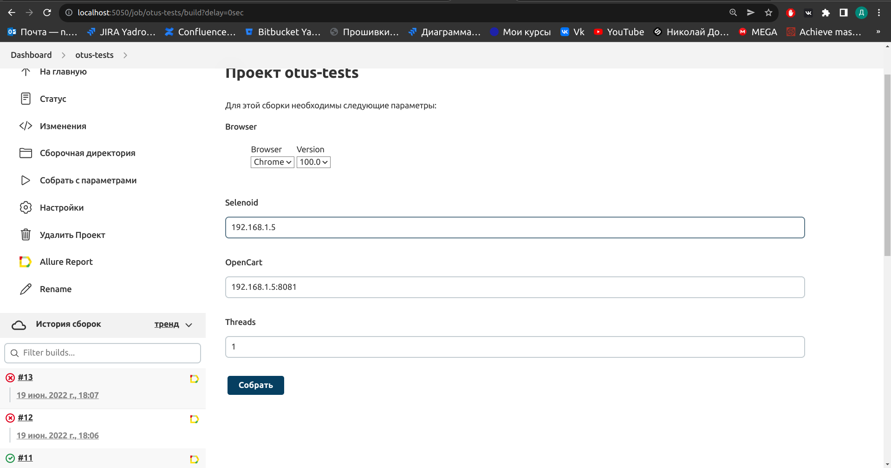

# Проектная работа по курсу Python QA Engineer

## Введение

Темой данной проектной работы является автоматизация тестирования OpenCart.

Для успешной сдачи проекта необходимо:

1. Реализовать минимум 10 автотестов.
2. Развернуть Jenkins и настроить автоматический запуск.
3. Настроить отчётность по результатам прогона.

При этом оцениваться проект будет по следующим критериям:

1. Использование паттерна PageObject.
2. Использование отчётности и возможностей Allure (title, steps, attach).
3. Минимум 10 автотестов.
4. Реализовать прикрепление скриншота при падении.
5. Запуск тестов выполняется из Jenkins, отчётность собирается там же.

## Проектный раздел

### Разворачивание OpenCart

Для начала необходимо развернуть локально приложение OpenCart и базы данных к нему.
Вся необходимая процедура описана в
файле [docker-compose.yml](https://github.com/Domochevskyy/otus_final_project/blob/main/docker-compose.yml).

### Написание автотестов

После разворачивания приложения OpenCart были реализованы автотесты с использованием паттерна PageObject.
Этот паттерн позволяет разделить тестовую логику и сами тесты непосредственно.
Благодаря ему получается писать легко поддерживаемый код в стиле ООП.
Тесты можно посмотреть вот [здесь](https://github.com/Domochevskyy/otus_final_project/tree/main/tests), а логику к
ним [вот тут](https://github.com/Domochevskyy/otus_final_project/tree/main/opencart_lib).

Одним из критериев оценки проекта является реализация прикрепление скриншота к allure-отчету при падении.
Данная фича присутствует в проекте как идущий "из коробки" хук pytest_runtest_makereport.
Каждый тест передает свой контекст управления в этот хук с помощью механизма "yield справа"
и если он имеет статус failed, то происходит прикрепление скриншота страницы к allure-отчету.

### Заворачивание автотестов в докер

Все реализованные автотесты были завернуты в докер для обеспечения всегда детерминированной среды выполнения.
Тут можно посмотреть [Dockerfile](https://github.com/Domochevskyy/otus_final_project/blob/main/Dockerfile) для
автотетсов.

### Разворачивание Selenoid

Локально был развернут selenoid - своего рода обертка над докером для удобной работы с выполнением,
отслеживанием и отладкой автотестов.

### Разворачивание Jenkins

Самая тяжелая часть проекта. Куча ошибок и минимальные шансы нагуглить их исправление.
Главная проблема - установка докер внутрь дженкинса. Никак не удавалось установить сертификаты и gpg keys.
Проблему удалось решить, добавив параметр загрузки DEBIAN_FRONTEND=noninteractive.
Тут можно посмотреть [Dockerfile](https://github.com/Domochevskyy/otus_final_project/blob/main/jenkins/Dockerfile) для
Jenkins'a.

Следующим шагом нужно было настроить сборку, которая будет автоматически запускать тесты.

Была реализована сборка, которая автоматически удаляет устаревшие сборки, имеет параметры для запуска,
берет код из текущего репозитория и генерирует allure-отчет.

